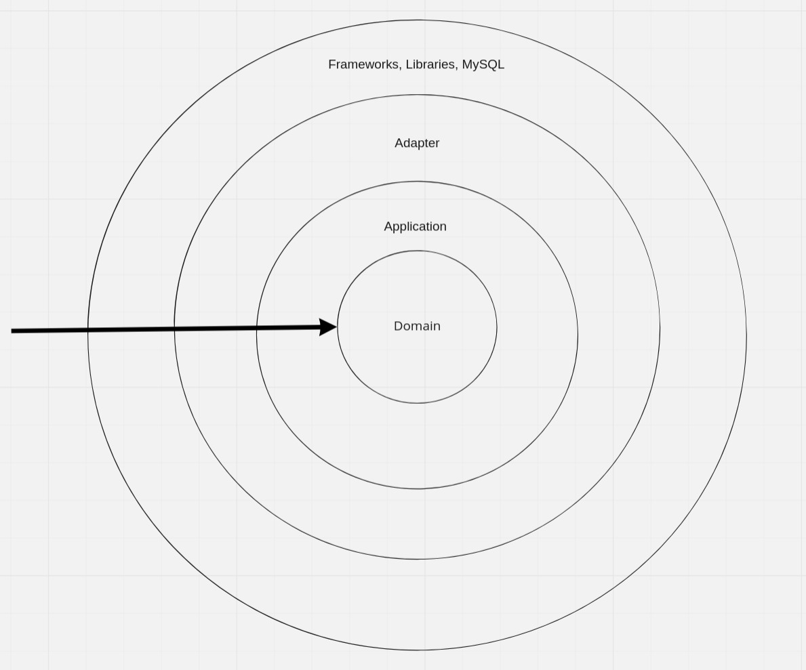

# game-rest-api
Game REST API. Designed with CLEAN Architecture in mind.
## Project Architecture


## Requirements
- Go v1.19

## Install
```shell
make install
```

## Development
```shell
make docker-build
```
```shell
make docker-run
```
```shell
make test
```
```shell
make dev
```
## Run
1. Assign `MYSQL_DSN` in `.env`
```shell
make run
```
## Examples
For examples on how to use the REST API, check out the [examples page](examples/README.md)


